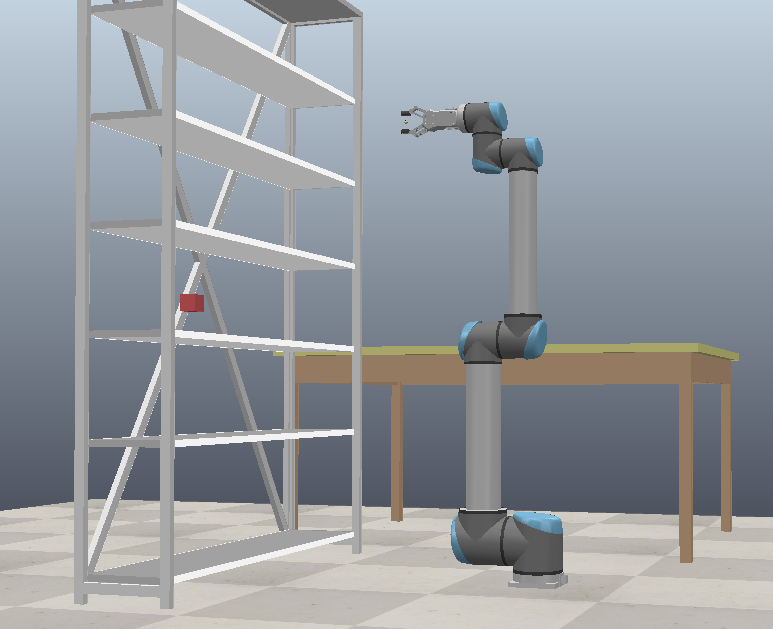

# CoppeliaUR10_BiRRT_GM_GB
Experiments with BiRRT algorithm using Gaussian Mixture trained on collected data with GoalBias on UR10 manipulator from CoppeliaSim.


# Installation

### Clone this repository
```bash
git clone git@github.com:euskov17/CoppeliaUR10_BiRRT_GM_GB.git
cd CoppeliaUR10_BiRRT_GM_GB
```

### Install requirements

```bash
python install -r requirements.txt
```

### Install CoppeliaSim

Install CoppeliaSim application from https://coppeliarobotics.com/

# Running examples

Example of running Bi-RRT algorithm is presented in [example.ipynb](./example.ipynb).

Before running example run `./coppeliaSim` and load scene in application `file->load_scene`.

Using for experiments scene is located in [scenes/ur10_scene_red.ttt](./scenes/ur10_scene.ttt)




# Visualisation examples


<video width="630" height="300" src="videos/2024-05-12_22-53-17.mp4.mp4"></video>
